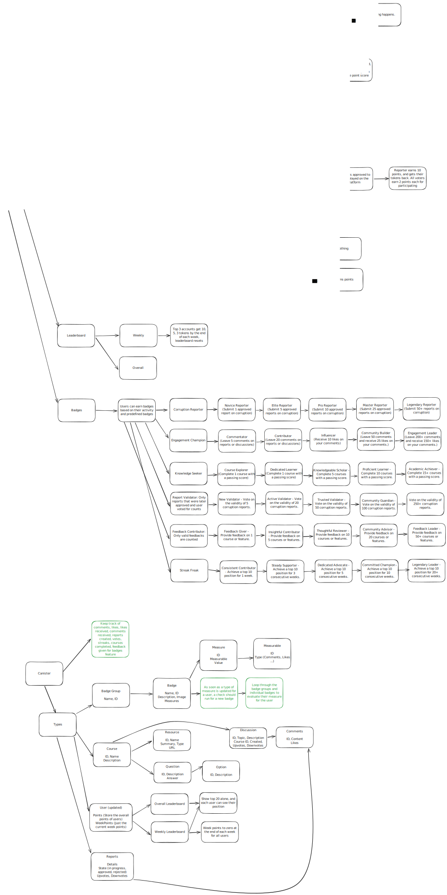

# PatriotAI 🛡️

PatriotAI is a decentralized learning platform that combines UN anti-corruption resources, ICP blockchain technology, and artificial intelligence to educate people about corruption and facilitate data collection on corruption cases.

## Infrastructure

PatriotAi is built on the IC using Motoko as the backend programming language and ReactJs for the front end. It uses a custom-trained OpenAI model for course and quiz generation and has an ACL for managing courses. The team reviews and approves generated courses before users can take them.

Once users complete a course, they are issued a custom token, UNK, built and deployed on the IC.

It has a chatbot for each course, that helps the user have an interactive learning.

PatriotAi used the following from IC:

1. HTTPS outcalls
2. Timers
3. ICRC1
4. Internet Identity

Live link (mainnet): [PatriotAI](https://kzwfs-haaaa-aaaak-ak3uq-cai.icp0.io)
PitchDeck: [PitchDeck](https://shorturl.at/Gx6k7)

## 🎯 Mission

To empower citizens worldwide with knowledge and tools to understand, identify, and fight corruption through education and secure reporting mechanisms.

## ✨ Key Features

### Learning Platform

- Interactive courses on understanding corruption
- AI-powered Q&A system for personalized learning
- Curriculum based on UN anti-corruption resources
- Quiz-based assessment with reward system

### Corruption Reporting DAO

- Secure, blockchain-based reporting system
- Anonymous reporting options
- Data collection and analysis
- Community response system
- Vote-based decision-making

### Reward System

- Earn Patriot tokens for completing quizzes
- 10 tokens per successfully completed quiz
- Token-based incentives for active participation
- Transparent reward distribution through blockchain

### Gamification

- Weekly & Overall leaderboard for top learners
- Badges and achievements to reward engagements of all kinds

## 🚀 Getting Started

1. Visit [PatriotAI](https://kzwfs-haaaa-aaaak-ak3uq-cai.icp0.io/)
2. Create an account (no personal details required)
3. Enroll in your first course
4. Start learning and earning tokens

## 💡 Use Cases

- **Educational Institutions**: Integrate anti-corruption education
- **Civil Society Organizations**: Train staff and volunteers
- **Citizens**: Learn about and report corruption
- **Researchers**: Access anonymized corruption data

## 🔐 Privacy & Security

- Decentralized architecture using ICP blockchain
- Anonymous reporting system
- End-to-end encryption for sensitive data
- No personal details required for basic usage

## 🌟 Benefits

- Free access to comprehensive corruption education
- Interactive learning with AI assistance
- Secure platform for reporting corruption
- Reward system for active participation
- Community-driven response system

## 📊 Technical Stack

- Frontend: ReactJs
- Infrastructure: Internet Computer Protocol (ICP)
- AI Integration: OpenAI
- Smart Contracts: Motoko

## 🌐 Community & Support

- [OpenChat](https://oc.app/group/gew2y-xqaaa-aaaar-blh4a-cai/?ref=fs5fq-eqaaa-aaaar-a27ca-cai&code=2e22cbdcc1bed49e)
- [Documentation](https://kzwfs-haaaa-aaaak-ak3uq-cai.icp0.io/)
- [Twitter](https://x.com/UnkorruptAI)

## 📈 Project Status



## 🙏 Acknowledgments

- United Nations Anti-Corruption Resources
- Internet Computer Protocol
- [Other partners and supporters]

If you want to start working on your project right away, you might want to try the following commands:

```bash
cd UNKORRUPT/
dfx help
dfx canister --help
```

## Running the project locally

If you want to test your project locally, you can use the following commands:

```bash
# Starts the replica, running in the background
dfx start --background

# Deploys your canisters to the replica and generates your candid interface
dfx deploy
```

Once the job completes, your application will be available at `http://localhost:4943?canisterId={asset_canister_id}`.

If you have made changes to your backend canister, you can generate a new candid interface with

```bash
npm run generate
```

at any time. This is recommended before starting the frontend development server, and will be run automatically any time you run `dfx deploy`.

If you are making frontend changes, you can start a development server with

```bash
npm start
```

Which will start a server at `http://localhost:8080`, proxying API requests to the replica at port 4943.

### Note on frontend environment variables

If you are hosting frontend code somewhere without using DFX, you may need to make one of the following adjustments to ensure your project does not fetch the root key in production:

- set`DFX_NETWORK` to `ic` if you are using Webpack
- use your own preferred method to replace `process.env.DFX_NETWORK` in the autogenerated declarations
  - Setting `canisters -> {asset_canister_id} -> declarations -> env_override to a string` in `dfx.json` will replace `process.env.DFX_NETWORK` with the string in the autogenerated declarations
- Write your own `createActor` constructor

---

Built with ❤️ for a corruption-free world
